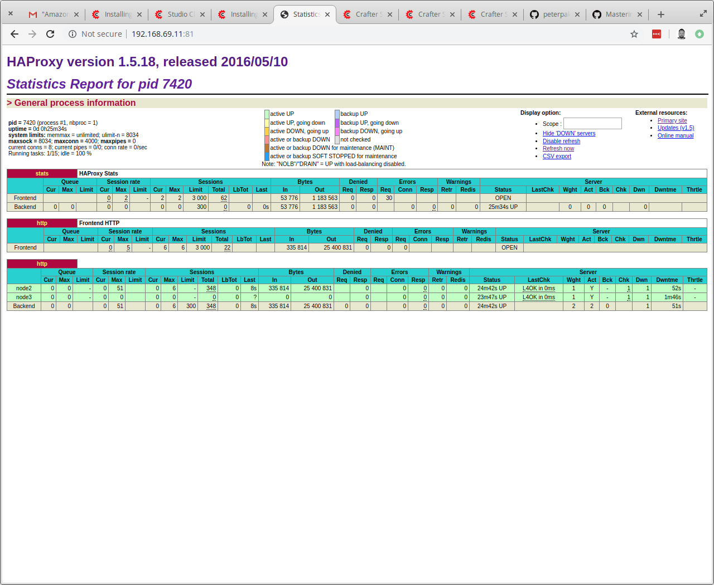
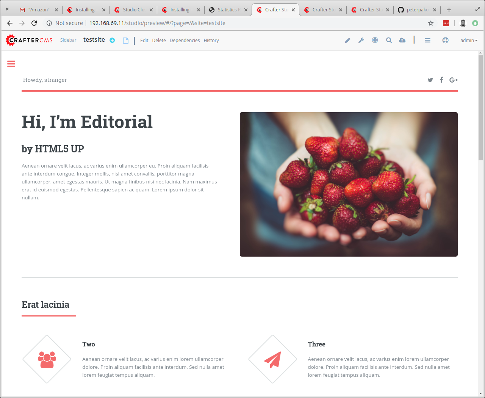

# Crafter CMS HA Deployment Automation

## Overview
The project automates the creation of a highly available environment running
[Crafter CMS 3.1.3](https://craftercms.org/).

By default the environment consists of 3 VMs spun up in VirtualBox via Vagrant
and provisioned using Ansible. The number of instances in the cluster is
configurable (see [Detailed setup information](#Detailed-setup-information)
section below).

For the demonstration purposes I have decided to run the automation locally
using Vagrant/VirtualBox/Ansible as these tools are Open Source, reliable and
free to use.

I expect the Ansible automation code to be reusable in other on-prem and Cloud
environments including AWS, GCP and Azure (please note, additional tools,
configuration and suitable inventory file will be required).

The solution has been tested in an environment which had the following tools
installed:
- Elementary OS 5.0 Juno
- Vagrant 2.2.5
- VirtualBox 6.0.12
- Ansible 2.8.5
- GNU Make 4.1
- GNU Wget 1.19.4
- Git 2.17.1

## Detailed setup information
The project utilises my own CentOS 7 Vagrant box [`peterpakos/centos-7`](https://app.vagrantup.com/peterpakos/boxes/centos-7)
which is based on the vanilla `centos/7` box with updated OS and the latest VB
Guest Additions pre-installed (to save time on initial /vagrant folder rsync).

To save disk space and time on multiple downloads I decided to pre-fetch
the Crafter CMS tarball during Make's fetch target (part of `make deploy`).
This way the tarball can be found in each node's /vagrant/files folders which,
thanks to VB Guest Additions, get mounted rather than rsynced from the host.

List of nodes deployed in the default 3-nodes scenario:
- node1: MariaDB and HAProxy ([HAProxy Stats Page](http://192.168.69.11:81/),
[Load Balanced Crafter CMS Studio](http://192.168.69.11/studio/))
- node2: [Crafter CMS](http://192.168.69.12:8080/studio/)
- node3: [Crafter CMS](http://192.168.69.13:8080/studio/)

As you can see above, the first node in the cluster is used as the central DB
server and load balancer for Crafter CMS Studio. The remaining nodes are
provisioned as backend Crafter CMS servers.

### MariaDB and HAProxy node
As per the [Studio Clustering documentation](https://docs.craftercms.org/en/3.1/system-administrators/activities/clustering.html),
an external MariaDB database and a load balancer with sticky session support
enabled must be set up. I used a highly performant and reliable HAProxy for
load balacing needs. 

For the demonstration purposes I decided to install the DB and LB on the same
server. In production, you may want to separate them and use more robust
services like AWS RDS and AWS ALB.

## Scaling up and out
By default the project uses 3 nodes, each with 2 vCores and 4GB RAM. It can be
scaled both vertically and horizontally.

### Horizontal scaling
The number of nodes in the cluster can be selected by setting the environment
variable `N` when deploying/scaling the environment:
```
N=4 make deploy
N=4 make destroy
```
or
```
export N=4
make deploy
make destroy
```

When you run `N=x make deploy` where `x` is higher than current number of nodes
in the cluster, new node/nodes will be deployed and Ansible provisioning will
be run against all nodes in the cluster. This will automatically configure new
nodes and add them to the Load Balancer as new backends.

### Vertical scaling
In order to adjust number of CPU cores and RAM (in MBs) assigned to each VM,
set environment variables `CPU` and `RAM` when creating the environment:
```
CPU=4 RAM=8192 make deploy
```

If you want to scale the instances up after the deployment, the instances will
have to be reloaded (restarted). Run:
```
CPU=4 RAM=8192 make reload
```

## Prerequisites
Before starting the deployment, please make sure enough resources are available
on the host machine and the latest version of the following tools is installed: 
- Vagrant
- VirtualBox
- Ansible
- Make
- Wget
- Git

In order to clone the repository to a local machine, run:
```
git clone https://github.com/peterpakos/craftercms.git
cd craftercms/
```

## Deploy
To create and provision new environment, run:
```
make deploy
```

## Provision
If you have made changes to the Ansible automation codebase and wish to re-run
the Ansible playbook to deploy these changes, run:
```
make provision
```

## Rebuild
To rebuild the existing environment, run:
```
make rebuild
```

## Destroy
To destroy the environment, run:
```
make destroy
```

## Clean
To clean up after finished deployment, run:
```
make clean
```
Please note, this command destroys the environment and deletes any downloaded
files.

## Screenshots
[HAProxy Stats Page](http://192.168.69.11:81/):


A test site in the [Load Balanced CrafterCMS Studio](http://192.168.69.11/studio/):


## Notes
I seem to be hitting some sort of bug in Crafter CMS after creating a new site
on any of the nodes - raised this as [bug #3527](https://github.com/craftercms/craftercms/issues/3527).

Below is the NPE error from `/opt/crafter/logs/tomcat/catalina.out`:
```
13-Oct-2019 18:19:51.388 INFO [main] org.apache.catalina.startup.Catalina.start Server startup in 84394 ms
[INFO] 2019-10-13T18:31:46,889 [http-nio-8080-exec-2] [security.AuthenticationChainImpl] | User admin logged in from IP: 192.168.69.1
[WARN] 2019-10-13T18:31:47,811 [http-nio-8080-exec-8] [git.GitContentRepositoryHelper] | Couldnt get the sandbox repository for site: testsite
[ERROR] 2019-10-13T18:31:47,816 [http-nio-8080-exec-8] [v2.ExceptionHandlers] | API endpoint http://192.168.69.13:8080/studio/api/2/users/me/sites?limit=15&offset=0 failed with response: ApiResponse{code=1000, message='Internal system failure', remedialAction='Contact support', documentationUrl=''}
java.lang.NullPointerException: null
        at org.craftercms.studio.impl.v1.repository.git.GitContentRepositoryHelper.getTreeForLastCommit(GitContentRepositoryHelper.java:666) ~[classes/:3.1.3]
        at org.craftercms.studio.impl.v1.repository.git.GitContentRepository.getContent(GitContentRepository.java:254) ~[classes/:3.1.3]
        at org.craftercms.studio.impl.v1.service.content.ContentServiceImpl.getContent(ContentServiceImpl.java:187) ~[classes/:3.1.3]
        at org.craftercms.studio.impl.v1.service.content.ContentServiceImpl.getContentAsDocument(ContentServiceImpl.java:225) ~[classes/:3.1.3]
        at sun.reflect.NativeMethodAccessorImpl.invoke0(Native Method) ~[?:1.8.0_222]
        at sun.reflect.NativeMethodAccessorImpl.invoke(NativeMethodAccessorImpl.java:62) ~[?:1.8.0_222]
        at sun.reflect.DelegatingMethodAccessorImpl.invoke(DelegatingMethodAccessorImpl.java:43) ~[?:1.8.0_222]
        at java.lang.reflect.Method.invoke(Method.java:498) ~[?:1.8.0_222]
        at org.springframework.aop.support.AopUtils.invokeJoinpointUsingReflection(AopUtils.java:333) ~[spring-aop-4.3.18.RELEASE.jar:4.3.18.RELEASE]
        at org.springframework.aop.framework.ReflectiveMethodInvocation.invokeJoinpoint(ReflectiveMethodInvocation.java:190) ~[spring-aop-4.3.18.RELEASE.jar:4.3.18.RELEASE]
        at org.springframework.aop.framework.ReflectiveMethodInvocation.proceed(ReflectiveMethodInvocation.java:157) ~[spring-aop-4.3.18.RELEASE.jar:4.3.18.RELEASE]
        at org.springframework.aop.framework.adapter.MethodBeforeAdviceInterceptor.invoke(MethodBeforeAdviceInterceptor.java:52) ~[spring-aop-4.3.18.RELEASE.jar:4.3.18.RELEASE]
        at org.springframework.aop.framework.ReflectiveMethodInvocation.proceed(ReflectiveMethodInvocation.java:168) ~[spring-aop-4.3.18.RELEASE.jar:4.3.18.RELEASE]
        at org.springframework.aop.interceptor.ExposeInvocationInterceptor.invoke(ExposeInvocationInterceptor.java:92) ~[spring-aop-4.3.18.RELEASE.jar:4.3.18.RELEASE]
        at org.springframework.aop.framework.ReflectiveMethodInvocation.proceed(ReflectiveMethodInvocation.java:179) ~[spring-aop-4.3.18.RELEASE.jar:4.3.18.RELEASE]
        at org.springframework.aop.framework.JdkDynamicAopProxy.invoke(JdkDynamicAopProxy.java:213) ~[spring-aop-4.3.18.RELEASE.jar:4.3.18.RELEASE]
        at com.sun.proxy.$Proxy44.getContentAsDocument(Unknown Source) ~[?:?]
        at org.craftercms.studio.impl.v2.service.configuration.ConfigurationServiceImpl.geRoleMappings(ConfigurationServiceImpl.java:108) ~[classes/:3.1.3]
        at sun.reflect.NativeMethodAccessorImpl.invoke0(Native Method) ~[?:1.8.0_222]
        at sun.reflect.NativeMethodAccessorImpl.invoke(NativeMethodAccessorImpl.java:62) ~[?:1.8.0_222]
        at sun.reflect.DelegatingMethodAccessorImpl.invoke(DelegatingMethodAccessorImpl.java:43) ~[?:1.8.0_222]
        at java.lang.reflect.Method.invoke(Method.java:498) ~[?:1.8.0_222]
        at org.springframework.aop.support.AopUtils.invokeJoinpointUsingReflection(AopUtils.java:333) ~[spring-aop-4.3.18.RELEASE.jar:4.3.18.RELEASE]
        at org.springframework.aop.framework.ReflectiveMethodInvocation.invokeJoinpoint(ReflectiveMethodInvocation.java:190) ~[spring-aop-4.3.18.RELEASE.jar:4.3.18.RELEASE]
        at org.springframework.aop.framework.ReflectiveMethodInvocation.proceed(ReflectiveMethodInvocation.java:157) ~[spring-aop-4.3.18.RELEASE.jar:4.3.18.RELEASE]
        at org.springframework.aop.interceptor.ExposeInvocationInterceptor.invoke(ExposeInvocationInterceptor.java:92) ~[spring-aop-4.3.18.RELEASE.jar:4.3.18.RELEASE]
        at org.springframework.aop.framework.ReflectiveMethodInvocation.proceed(ReflectiveMethodInvocation.java:179) ~[spring-aop-4.3.18.RELEASE.jar:4.3.18.RELEASE]
        at org.springframework.aop.framework.JdkDynamicAopProxy.invoke(JdkDynamicAopProxy.java:213) ~[spring-aop-4.3.18.RELEASE.jar:4.3.18.RELEASE]
        at com.sun.proxy.$Proxy54.geRoleMappings(Unknown Source) ~[?:?]
        at org.craftercms.studio.impl.v2.service.security.internal.GroupServiceInternalImpl.getSiteGroups(GroupServiceInternalImpl.java:301) ~[classes/:3.1.3]
        at org.craftercms.studio.impl.v2.service.security.UserServiceImpl.getUserSites(UserServiceImpl.java:304) ~[classes/:3.1.3]
        at org.craftercms.studio.impl.v2.service.security.UserServiceImpl.getCurrentUserSites(UserServiceImpl.java:391) ~[classes/:3.1.3]
        at sun.reflect.NativeMethodAccessorImpl.invoke0(Native Method) ~[?:1.8.0_222]
        at sun.reflect.NativeMethodAccessorImpl.invoke(NativeMethodAccessorImpl.java:62) ~[?:1.8.0_222]
        at sun.reflect.DelegatingMethodAccessorImpl.invoke(DelegatingMethodAccessorImpl.java:43) ~[?:1.8.0_222]
        at java.lang.reflect.Method.invoke(Method.java:498) ~[?:1.8.0_222]
        at org.springframework.aop.support.AopUtils.invokeJoinpointUsingReflection(AopUtils.java:333) ~[spring-aop-4.3.18.RELEASE.jar:4.3.18.RELEASE]
        at org.springframework.aop.framework.ReflectiveMethodInvocation.invokeJoinpoint(ReflectiveMethodInvocation.java:190) ~[spring-aop-4.3.18.RELEASE.jar:4.3.18.RELEASE]
        at org.springframework.aop.framework.ReflectiveMethodInvocation.proceed(ReflectiveMethodInvocation.java:157) ~[spring-aop-4.3.18.RELEASE.jar:4.3.18.RELEASE]
        at org.springframework.aop.interceptor.ExposeInvocationInterceptor.invoke(ExposeInvocationInterceptor.java:92) ~[spring-aop-4.3.18.RELEASE.jar:4.3.18.RELEASE]
        at org.springframework.aop.framework.ReflectiveMethodInvocation.proceed(ReflectiveMethodInvocation.java:179) ~[spring-aop-4.3.18.RELEASE.jar:4.3.18.RELEASE]
        at org.springframework.aop.framework.JdkDynamicAopProxy.invoke(JdkDynamicAopProxy.java:213) ~[spring-aop-4.3.18.RELEASE.jar:4.3.18.RELEASE]
        at com.sun.proxy.$Proxy56.getCurrentUserSites(Unknown Source) ~[?:?]
        at org.craftercms.studio.controller.rest.v2.UsersController.getCurrentUserSites(UsersController.java:353) ~[classes/:3.1.3]
        at sun.reflect.NativeMethodAccessorImpl.invoke0(Native Method) ~[?:1.8.0_222]
        at sun.reflect.NativeMethodAccessorImpl.invoke(NativeMethodAccessorImpl.java:62) ~[?:1.8.0_222]
        at sun.reflect.DelegatingMethodAccessorImpl.invoke(DelegatingMethodAccessorImpl.java:43) ~[?:1.8.0_222]
        at java.lang.reflect.Method.invoke(Method.java:498) ~[?:1.8.0_222]
        at org.springframework.web.method.support.InvocableHandlerMethod.doInvoke(InvocableHandlerMethod.java:205) ~[spring-web-4.3.18.RELEASE.jar:4.3.18.RELEASE]
        at org.springframework.web.method.support.InvocableHandlerMethod.invokeForRequest(InvocableHandlerMethod.java:133) ~[spring-web-4.3.18.RELEASE.jar:4.3.18.RELEASE]
        at org.springframework.web.servlet.mvc.method.annotation.ServletInvocableHandlerMethod.invokeAndHandle(ServletInvocableHandlerMethod.java:97) ~[spring-webmvc-4.3.18.RELEASE.jar:4.3.18.RELEASE]
        at org.springframework.web.servlet.mvc.method.annotation.RequestMappingHandlerAdapter.invokeHandlerMethod(RequestMappingHandlerAdapter.java:827) ~[spring-webmvc-4.3.18.RELEASE.jar:4.3.18.RELEASE]
        at org.springframework.web.servlet.mvc.method.annotation.RequestMappingHandlerAdapter.handleInternal(RequestMappingHandlerAdapter.java:738) ~[spring-webmvc-4.3.18.RELEASE.jar:4.3.18.RELEASE]
        at org.springframework.web.servlet.mvc.method.AbstractHandlerMethodAdapter.handle(AbstractHandlerMethodAdapter.java:85) ~[spring-webmvc-4.3.18.RELEASE.jar:4.3.18.RELEASE]
        at org.springframework.web.servlet.DispatcherServlet.doDispatch(DispatcherServlet.java:967) [spring-webmvc-4.3.18.RELEASE.jar:4.3.18.RELEASE]
        at org.springframework.web.servlet.DispatcherServlet.doService(DispatcherServlet.java:901) [spring-webmvc-4.3.18.RELEASE.jar:4.3.18.RELEASE]
        at org.springframework.web.servlet.FrameworkServlet.processRequest(FrameworkServlet.java:970) [spring-webmvc-4.3.18.RELEASE.jar:4.3.18.RELEASE]
        at org.springframework.web.servlet.FrameworkServlet.doGet(FrameworkServlet.java:861) [spring-webmvc-4.3.18.RELEASE.jar:4.3.18.RELEASE]
        at javax.servlet.http.HttpServlet.service(HttpServlet.java:635) [servlet-api.jar:?]
        at org.springframework.web.servlet.FrameworkServlet.service(FrameworkServlet.java:846) [spring-webmvc-4.3.18.RELEASE.jar:4.3.18.RELEASE]
        at javax.servlet.http.HttpServlet.service(HttpServlet.java:742) [servlet-api.jar:?]
        at org.apache.catalina.core.ApplicationFilterChain.internalDoFilter(ApplicationFilterChain.java:231) [catalina.jar:8.5.24]
        at org.apache.catalina.core.ApplicationFilterChain.doFilter(ApplicationFilterChain.java:166) [catalina.jar:8.5.24]
        at org.apache.tomcat.websocket.server.WsFilter.doFilter(WsFilter.java:52) [tomcat-websocket.jar:8.5.24]
        at org.apache.catalina.core.ApplicationFilterChain.internalDoFilter(ApplicationFilterChain.java:193) [catalina.jar:8.5.24]
        at org.apache.catalina.core.ApplicationFilterChain.doFilter(ApplicationFilterChain.java:166) [catalina.jar:8.5.24]
        at org.springframework.web.filter.OncePerRequestFilter.doFilter(OncePerRequestFilter.java:101) [spring-web-4.3.18.RELEASE.jar:4.3.18.RELEASE]
        at org.springframework.web.filter.DelegatingFilterProxy.invokeDelegate(DelegatingFilterProxy.java:347) [spring-web-4.3.18.RELEASE.jar:4.3.18.RELEASE]
        at org.springframework.web.filter.DelegatingFilterProxy.doFilter(DelegatingFilterProxy.java:263) [spring-web-4.3.18.RELEASE.jar:4.3.18.RELEASE]
        at org.apache.catalina.core.ApplicationFilterChain.internalDoFilter(ApplicationFilterChain.java:193) [catalina.jar:8.5.24]
        at org.apache.catalina.core.ApplicationFilterChain.doFilter(ApplicationFilterChain.java:166) [catalina.jar:8.5.24]
        at org.tuckey.web.filters.urlrewrite.RuleChain.handleRewrite(RuleChain.java:176) [urlrewritefilter-4.0.4.jar:4.0.4]
        at org.tuckey.web.filters.urlrewrite.RuleChain.doRules(RuleChain.java:145) [urlrewritefilter-4.0.4.jar:4.0.4]
        at org.tuckey.web.filters.urlrewrite.UrlRewriter.processRequest(UrlRewriter.java:92) [urlrewritefilter-4.0.4.jar:4.0.4]
        at org.craftercms.engine.url.rewrite.UrlRewriteFilter.doFilter(UrlRewriteFilter.java:70) [classes/:3.1.3]
        at org.springframework.web.filter.DelegatingFilterProxy.invokeDelegate(DelegatingFilterProxy.java:347) [spring-web-4.3.18.RELEASE.jar:4.3.18.RELEASE]
        at org.springframework.web.filter.DelegatingFilterProxy.doFilter(DelegatingFilterProxy.java:263) [spring-web-4.3.18.RELEASE.jar:4.3.18.RELEASE]
        at org.apache.catalina.core.ApplicationFilterChain.internalDoFilter(ApplicationFilterChain.java:193) [catalina.jar:8.5.24]
        at org.apache.catalina.core.ApplicationFilterChain.doFilter(ApplicationFilterChain.java:166) [catalina.jar:8.5.24]
        at org.springframework.security.web.csrf.CsrfFilter.doFilterInternal(CsrfFilter.java:100) [spring-security-web-4.2.13.RELEASE.jar:4.2.13.RELEASE]
        at org.springframework.web.filter.OncePerRequestFilter.doFilter(OncePerRequestFilter.java:107) [spring-web-4.3.18.RELEASE.jar:4.3.18.RELEASE]
        at org.springframework.web.filter.DelegatingFilterProxy.invokeDelegate(DelegatingFilterProxy.java:347) [spring-web-4.3.18.RELEASE.jar:4.3.18.RELEASE]
        at org.springframework.web.filter.DelegatingFilterProxy.doFilter(DelegatingFilterProxy.java:263) [spring-web-4.3.18.RELEASE.jar:4.3.18.RELEASE]
        at org.apache.catalina.core.ApplicationFilterChain.internalDoFilter(ApplicationFilterChain.java:193) [catalina.jar:8.5.24]
        at org.apache.catalina.core.ApplicationFilterChain.doFilter(ApplicationFilterChain.java:166) [catalina.jar:8.5.24]
        at org.springframework.security.web.FilterChainProxy$VirtualFilterChain.doFilter(FilterChainProxy.java:317) [spring-security-web-4.2.13.RELEASE.jar:4.2.13.RELEASE]
        at org.springframework.security.web.access.intercept.FilterSecurityInterceptor.invoke(FilterSecurityInterceptor.java:127) [spring-security-web-4.2.13.RELEASE.jar:4.2.13.RELEASE]
        at org.springframework.security.web.access.intercept.FilterSecurityInterceptor.doFilter(FilterSecurityInterceptor.java:91) [spring-security-web-4.2.13.RELEASE.jar:4.2.13.RELEASE]
        at org.springframework.security.web.FilterChainProxy$VirtualFilterChain.doFilter(FilterChainProxy.java:331) [spring-security-web-4.2.13.RELEASE.jar:4.2.13.RELEASE]
        at org.springframework.security.web.access.ExceptionTranslationFilter.doFilter(ExceptionTranslationFilter.java:114) [spring-security-web-4.2.13.RELEASE.jar:4.2.13.RELEASE]
        at org.springframework.security.web.FilterChainProxy$VirtualFilterChain.doFilter(FilterChainProxy.java:331) [spring-security-web-4.2.13.RELEASE.jar:4.2.13.RELEASE]
        at org.springframework.security.web.authentication.AnonymousAuthenticationFilter.doFilter(AnonymousAuthenticationFilter.java:111) [spring-security-web-4.2.13.RELEASE.jar:4.2.13.RELEASE]
        at org.springframework.security.web.FilterChainProxy$VirtualFilterChain.doFilter(FilterChainProxy.java:331) [spring-security-web-4.2.13.RELEASE.jar:4.2.13.RELEASE]
        at org.springframework.security.web.servletapi.SecurityContextHolderAwareRequestFilter.doFilter(SecurityContextHolderAwareRequestFilter.java:170) [spring-security-web-4.2.13.RELEASE.jar:4.2.13.RELEASE]
        at org.springframework.security.web.FilterChainProxy$VirtualFilterChain.doFilter(FilterChainProxy.java:331) [spring-security-web-4.2.13.RELEASE.jar:4.2.13.RELEASE]
        at org.craftercms.studio.impl.v1.web.security.access.StudioAuthenticationTokenProcessingFilter.doFilter(StudioAuthenticationTokenProcessingFilter.java:151) [classes/:3.1.3]
        at org.springframework.security.web.FilterChainProxy$VirtualFilterChain.doFilter(FilterChainProxy.java:331) [spring-security-web-4.2.13.RELEASE.jar:4.2.13.RELEASE]
        at org.springframework.security.web.header.HeaderWriterFilter.doFilterInternal(HeaderWriterFilter.java:66) [spring-security-web-4.2.13.RELEASE.jar:4.2.13.RELEASE]
        at org.springframework.web.filter.OncePerRequestFilter.doFilter(OncePerRequestFilter.java:107) [spring-web-4.3.18.RELEASE.jar:4.3.18.RELEASE]
        at org.springframework.security.web.FilterChainProxy$VirtualFilterChain.doFilter(FilterChainProxy.java:331) [spring-security-web-4.2.13.RELEASE.jar:4.2.13.RELEASE]
        at org.springframework.security.web.context.request.async.WebAsyncManagerIntegrationFilter.doFilterInternal(WebAsyncManagerIntegrationFilter.java:56) [spring-security-web-4.2.13.RELEASE.jar:4.2.13.RELEASE]
        at org.springframework.web.filter.OncePerRequestFilter.doFilter(OncePerRequestFilter.java:107) [spring-web-4.3.18.RELEASE.jar:4.3.18.RELEASE]
        at org.springframework.security.web.FilterChainProxy$VirtualFilterChain.doFilter(FilterChainProxy.java:331) [spring-security-web-4.2.13.RELEASE.jar:4.2.13.RELEASE]
        at org.springframework.security.web.context.SecurityContextPersistenceFilter.doFilter(SecurityContextPersistenceFilter.java:105) [spring-security-web-4.2.13.RELEASE.jar:4.2.13.RELEASE]
        at org.springframework.security.web.FilterChainProxy$VirtualFilterChain.doFilter(FilterChainProxy.java:331) [spring-security-web-4.2.13.RELEASE.jar:4.2.13.RELEASE]
        at org.springframework.security.web.FilterChainProxy.doFilterInternal(FilterChainProxy.java:214) [spring-security-web-4.2.13.RELEASE.jar:4.2.13.RELEASE]
        at org.springframework.security.web.FilterChainProxy.doFilter(FilterChainProxy.java:177) [spring-security-web-4.2.13.RELEASE.jar:4.2.13.RELEASE]
        at org.springframework.web.filter.DelegatingFilterProxy.invokeDelegate(DelegatingFilterProxy.java:347) [spring-web-4.3.18.RELEASE.jar:4.3.18.RELEASE]
        at org.springframework.web.filter.DelegatingFilterProxy.doFilter(DelegatingFilterProxy.java:263) [spring-web-4.3.18.RELEASE.jar:4.3.18.RELEASE]
        at org.apache.catalina.core.ApplicationFilterChain.internalDoFilter(ApplicationFilterChain.java:193) [catalina.jar:8.5.24]
        at org.apache.catalina.core.ApplicationFilterChain.doFilter(ApplicationFilterChain.java:166) [catalina.jar:8.5.24]
        at org.craftercms.engine.servlet.filter.ExceptionHandlingFilter.doFilter(ExceptionHandlingFilter.java:56) [classes/:3.1.3]
        at org.springframework.web.filter.DelegatingFilterProxy.invokeDelegate(DelegatingFilterProxy.java:347) [spring-web-4.3.18.RELEASE.jar:4.3.18.RELEASE]
        at org.springframework.web.filter.DelegatingFilterProxy.doFilter(DelegatingFilterProxy.java:263) [spring-web-4.3.18.RELEASE.jar:4.3.18.RELEASE]
        at org.apache.catalina.core.ApplicationFilterChain.internalDoFilter(ApplicationFilterChain.java:193) [catalina.jar:8.5.24]
        at org.apache.catalina.core.ApplicationFilterChain.doFilter(ApplicationFilterChain.java:166) [catalina.jar:8.5.24]
        at org.craftercms.engine.servlet.filter.SiteContextResolvingFilter.doFilter(SiteContextResolvingFilter.java:57) [classes/:3.1.3]
        at org.springframework.web.filter.DelegatingFilterProxy.invokeDelegate(DelegatingFilterProxy.java:347) [spring-web-4.3.18.RELEASE.jar:4.3.18.RELEASE]
        at org.springframework.web.filter.DelegatingFilterProxy.doFilter(DelegatingFilterProxy.java:263) [spring-web-4.3.18.RELEASE.jar:4.3.18.RELEASE]
        at org.apache.catalina.core.ApplicationFilterChain.internalDoFilter(ApplicationFilterChain.java:193) [catalina.jar:8.5.24]
        at org.apache.catalina.core.ApplicationFilterChain.doFilter(ApplicationFilterChain.java:166) [catalina.jar:8.5.24]
        at org.craftercms.commons.http.RequestContextBindingFilter.doFilter(RequestContextBindingFilter.java:79) [crafter-commons-utilities-3.1.3.jar:3.1.3]
        at org.apache.catalina.core.ApplicationFilterChain.internalDoFilter(ApplicationFilterChain.java:193) [catalina.jar:8.5.24]
        at org.apache.catalina.core.ApplicationFilterChain.doFilter(ApplicationFilterChain.java:166) [catalina.jar:8.5.24]
        at org.craftercms.studio.impl.v1.web.filter.MultiReadHttpServletRequestWrapperFilter.doFilter(MultiReadHttpServletRequestWrapperFilter.java:33) [classes/:3.1.3]
        at org.apache.catalina.core.ApplicationFilterChain.internalDoFilter(ApplicationFilterChain.java:193) [catalina.jar:8.5.24]
        at org.apache.catalina.core.ApplicationFilterChain.doFilter(ApplicationFilterChain.java:166) [catalina.jar:8.5.24]
        at org.apache.logging.log4j.web.Log4jServletFilter.doFilter(Log4jServletFilter.java:71) [log4j-web-2.11.2.jar:2.11.2]
        at org.apache.catalina.core.ApplicationFilterChain.internalDoFilter(ApplicationFilterChain.java:193) [catalina.jar:8.5.24]
        at org.apache.catalina.core.ApplicationFilterChain.doFilter(ApplicationFilterChain.java:166) [catalina.jar:8.5.24]
        at org.apache.catalina.core.StandardWrapperValve.invoke(StandardWrapperValve.java:198) [catalina.jar:8.5.24]
        at org.apache.catalina.core.StandardContextValve.invoke(StandardContextValve.java:96) [catalina.jar:8.5.24]
        at org.apache.catalina.authenticator.AuthenticatorBase.invoke(AuthenticatorBase.java:504) [catalina.jar:8.5.24]
        at org.apache.catalina.core.StandardHostValve.invoke(StandardHostValve.java:140) [catalina.jar:8.5.24]
        at org.apache.catalina.valves.ErrorReportValve.invoke(ErrorReportValve.java:81) [catalina.jar:8.5.24]
        at org.apache.catalina.valves.AbstractAccessLogValve.invoke(AbstractAccessLogValve.java:650) [catalina.jar:8.5.24]
        at org.apache.catalina.core.StandardEngineValve.invoke(StandardEngineValve.java:87) [catalina.jar:8.5.24]
        at org.apache.catalina.connector.CoyoteAdapter.service(CoyoteAdapter.java:342) [catalina.jar:8.5.24]
        at org.apache.coyote.http11.Http11Processor.service(Http11Processor.java:803) [tomcat-coyote.jar:8.5.24]
        at org.apache.coyote.AbstractProcessorLight.process(AbstractProcessorLight.java:66) [tomcat-coyote.jar:8.5.24]
        at org.apache.coyote.AbstractProtocol$ConnectionHandler.process(AbstractProtocol.java:790) [tomcat-coyote.jar:8.5.24]
        at org.apache.tomcat.util.net.NioEndpoint$SocketProcessor.doRun(NioEndpoint.java:1459) [tomcat-coyote.jar:8.5.24]
        at org.apache.tomcat.util.net.SocketProcessorBase.run(SocketProcessorBase.java:49) [tomcat-coyote.jar:8.5.24]
        at java.util.concurrent.ThreadPoolExecutor.runWorker(ThreadPoolExecutor.java:1149) [?:1.8.0_222]
        at java.util.concurrent.ThreadPoolExecutor$Worker.run(ThreadPoolExecutor.java:624) [?:1.8.0_222]
        at org.apache.tomcat.util.threads.TaskThread$WrappingRunnable.run(TaskThread.java:61) [tomcat-util.jar:8.5.24]
        at java.lang.Thread.run(Thread.java:748) [?:1.8.0_222]
[INFO] 2019-10-13T18:31:51,852 [Studio_Publisher_Thread_Pool1] [job.PublisherTask] | Invaid site UUID. Local copy will not be deleted
[WARN] 2019-10-13T18:31:51,852 [Studio_Publisher_Thread_Pool1] [git.GitContentRepositoryHelper] | Couldnt get the sandbox repository for site: testsite
[INFO] 2019-10-13T18:31:51,852 [Studio_Publisher_Thread_Pool1] [job.PublisherTask] | Publishing is disabled for site testsite
```